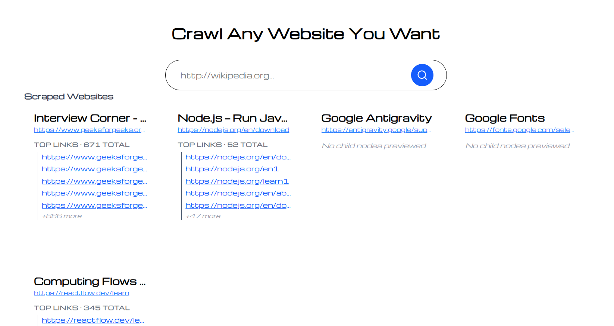
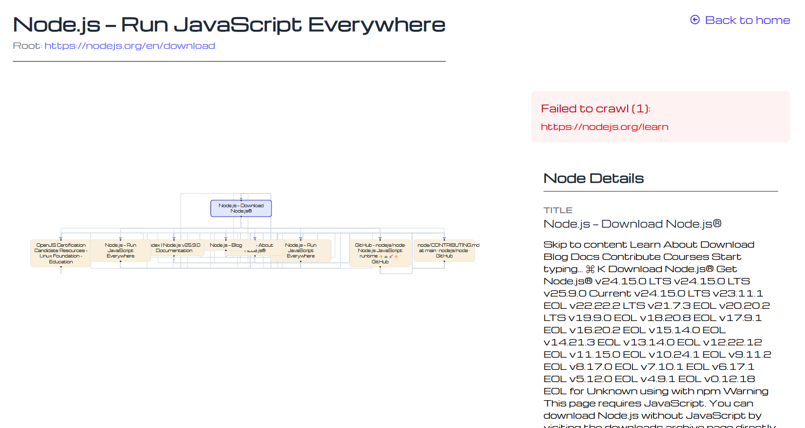

# Web Crawler
---

This project aims to take any website URL and crawl all the data within that URL and its sub-URLs across pages, then return a graph to help visualize and access the data inside it.
# Tools & Technologies

We use multiple technologies and frameworks to build this project:

* **Backend**: We use FastAPI as a backend framework. It helps build strong backend systems.
* **Database**: MongoDB for storing search history.
* **GUI**: React as a JavaScript framework to build the frontend interface.
# How to Start Project
---
You must install Python version greater than `3.12.3` from the official website:
[Download here](https://www.python.org/downloads/release/python-3144/)
This is Python `3.14.4`, the latest version as of 2026-04-29.

Download MongoDB locally on your machine and start the MongoDB server. Then set the connection URL inside the project in `db/mongodb.py` at line 5. The URL will look like this:

```python
client = AsyncIOMotorClient("mongodb://localhost:27017/")
```

To download MongoDB: [Download MongoDB Community Server](https://www.mongodb.com/try/download/community) This is the Community Edition, which is free to use. Instead of installing MongoDB locally, you can use:  [MongoDB Atlas](https://www.mongodb.com/products/platform/atlas-database)

Inside the project, open the terminal

```terminal
pip install poetry
```

Poetry is a package manager for Python projects. Instead of using `pip`, you should use `poetry`.

---

To install all dependencies required to run the server (listed in `pyproject.toml`):

```toml
dependencies = [
    "fastapi==0.135.3",
    "uvicorn==0.44.0",
    "motor==3.7.1",
    "beautifulsoup4 (>=4.14.3,<5.0.0)",
    "requests (>=2.33.1,<3.0.0)"
]
```

Run the following command:

```terminal
poetry install
```

This command installs all required packages like `fastapi`, `uvicorn`, `motor`, and others.
Now you can run the backend using:

```terminal
poetry run uvicorn main:app --reload
```

The server will run on port `8000`:
[http://localhost:8000](http://localhost:8000)
## Start Frontend Server
---
To start the frontend (built with React), you need to install Node.js: [Download Node.js](https://nodejs.org/en/download)
In the main project folder, run:

```terminal
cd client ; npm install ; npm run dev
```

---

The project has two main pages:

* **Home Page**: Contains an input field to take the URL from the user and display search history.



* **Web Crawl Page**: Displays details of a specific website.


